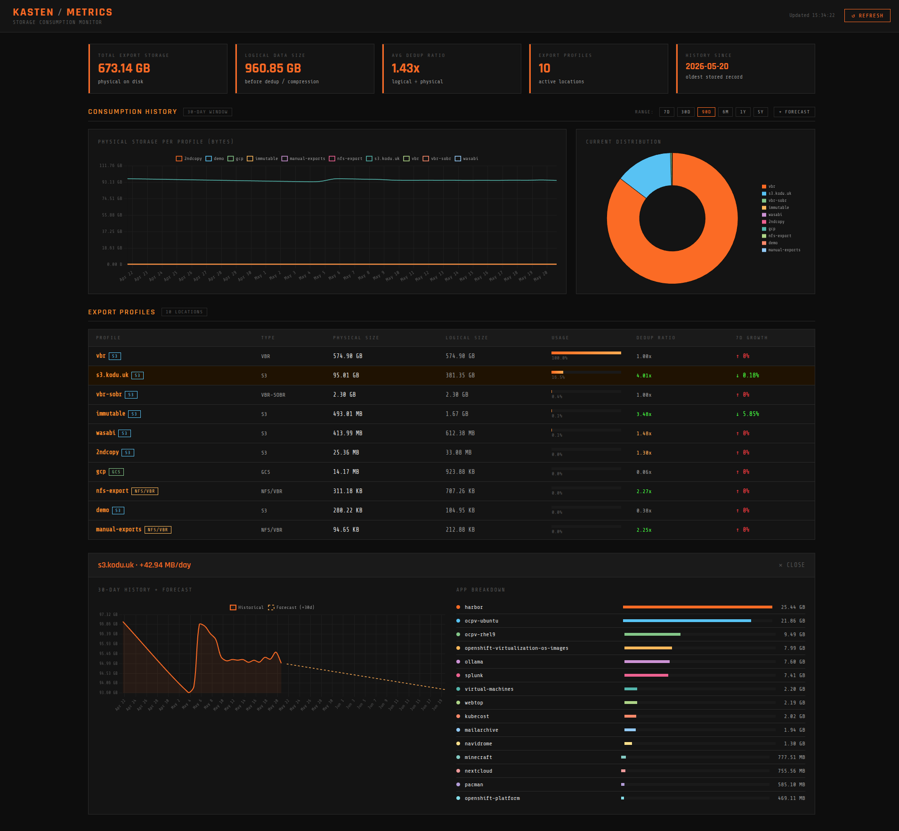

# kasten-metrics-model

A storage consumption monitor for [Kasten K10](https://www.kasten.io/) that provides historical trend analysis, dedup/compression ratios, per-profile breakdowns, and growth forecasting across all export locations — including S3, GCS, NFS, and Veeam VBR repositories.

Kasten's built-in dashboard has no long-term storage visibility. This application fills that gap by querying Kasten's internal Prometheus for live metrics, storing daily snapshots in SQLite for multi-year trending, and supplementing with direct VBR REST API data for Veeam-backed repositories.



---

## Features

- **Multi-profile consumption tracking** — S3, GCS, NFS, Veeam VBR, SOBR, and manual exports
- **Dedup/compression ratio** — logical vs physical bytes per profile, sourced from Kopia repository metrics
- **30-day live window** from Kasten's internal Prometheus (`export_storage_size_bytes`)
- **Long-term SQLite store** — daily scraper appends snapshots, 5-year retention, persisted on a PVC
- **Growth forecasting** — linear regression over all available history, configurable days ahead
- **Per-app breakdown** — click any profile to see namespace-level contribution
- **VBR/SOBR integration** — authenticates to Veeam REST API, maps repositories to Kasten profiles
- **Dark terminal UI** — Share Tech Mono aesthetic, Chart.js line/donut charts, 7D/30D/90D/6M/1Y/5Y range selector

---

## Architecture

```
┌─────────────────────────────────────────────────────┐
│  kasten-metrics-model namespace                     │
│                                                     │
│  Deployment (FastAPI + static frontend)             │
│    ├── Queries Prometheus live for current data     │
│    ├── Merges SQLite for historical data            │
│    └── Serves REST API + frontend                   │
│                                                     │
│  CronJob (daily scraper, 01:00 UTC)                 │
│    ├── Pulls export_storage_size_bytes from Prom    │
│    ├── Authenticates to VBR REST API                │
│    ├── Appends daily snapshot to SQLite             │
│    └── Purges rows older than 5 years               │
│                                                     │
│  PVC (rook-ceph-block, 1Gi)                         │
│    └── /data/metrics.db (SQLite)                    │
└─────────────────────────────────────────────────────┘
        │                          │
        ▼                          ▼
 prometheus-server.kasten-io   192.168.x.x:9419
 (internal Prometheus)          (Veeam VBR REST API)
```

### Data sources

| Profile type | Source | Metric |
|---|---|---|
| S3 / GCS | Kasten Prometheus | `export_storage_size_bytes{type="physical\|logical"}` |
| NFS | Kasten Prometheus | `export_storage_size_bytes` (blank endpoint) |
| VBR hardened repo | Veeam REST API | `/api/v1/backupInfrastructure/repositories/states` |
| VBR SOBR | Veeam REST API | Aggregated extent `usedSpaceGB` |

Profile identity is derived from Prometheus metric labels (`endpoint` + `bucket` for object store) and mapped to Kasten profile names via `profiles.config.kio.kasten.io` CRDs. NFS/policy-named repos are resolved via `policies.config.kio.kasten.io` export action references.

---

## Prerequisites

- OpenShift cluster with Kasten K10 deployed in `kasten-io` namespace
- Kasten's internal Prometheus running (`prometheus-server` service in `kasten-io`)
- Harbor registry (or adjust image references for your registry)
- Veeam VBR v12+ (optional — VBR integration is skipped if credentials not configured)
- Docker on the build host

---

## Project Structure

```
kasten-metrics-model/
├── Dockerfile
├── build.sh                  # Build + push + deploy
├── README.md
├── backend/
│   ├── main.py               # FastAPI application
│   ├── scraper.py            # Daily CronJob scraper
│   └── requirements.txt
├── frontend/
│   └── index.html            # Vanilla JS + Chart.js UI
└── manifests/
    └── deploy.yaml           # All Kubernetes resources
```

---

## Deployment

### 1. Configure VBR credentials (optional)

Edit `manifests/deploy.yaml` and update the `vbr-credentials` Secret:

```yaml
apiVersion: v1
kind: Secret
metadata:
  name: vbr-credentials
  namespace: kasten-metrics-model
stringData:
  url: "https://<vbr-host>:9419"
  username: "veeamadmin"
  password: "<password>"
  repo_map: "VBR=vbr,SOBR=vbr-sobr"   # VBR repo name=Kasten profile name
```

The `repo_map` is a comma-separated list of `VBR repository name=Kasten profile name` pairs. SOBR names are matched by aggregating their extents. Remove or leave blank to skip VBR integration.

### 2. Create Harbor project

Create a project named `kasten-metrics-model` in your Harbor instance before pushing.

### 3. Build and deploy

```bash
chmod +x build.sh
./build.sh
```

The script builds the image, pushes to Harbor, applies all manifests, and prints the Route URL.

### 4. Seed initial data

The CronJob runs daily at 01:00 UTC. To populate data immediately:

```bash
oc create job --from=cronjob/kasten-metrics-scraper seed-run -n kasten-metrics-model
oc logs -f job/seed-run -n kasten-metrics-model
```

---

## API Reference

| Endpoint | Description |
|---|---|
| `GET /api/health` | Health check, Prometheus URL, DB row count |
| `GET /api/profiles` | Current physical/logical bytes per profile with dedup ratio |
| `GET /api/summary` | Aggregated totals, 7-day growth per profile, oldest DB record |
| `GET /api/history?days=90&step=1d` | Merged time-series (SQLite + Prometheus), up to 1825 days |
| `GET /api/apps/{profile}` | Per-namespace breakdown for a profile (current snapshot) |
| `GET /api/forecast/{profile}?days_ahead=90` | Linear regression forecast |
| `GET /api/db/stats` | SQLite row count, oldest/newest record, file size |

History merges SQLite (data older than 29 days) with Prometheus (recent 29 days) transparently. Forecast uses up to 365 days of merged history for the regression.

---

## Configuration

All configuration is via environment variables on the Deployment and CronJob:

| Variable | Default | Description |
|---|---|---|
| `PROMETHEUS_URL` | `http://prometheus-server.kasten-io.svc/k10/prometheus` | Kasten internal Prometheus |
| `KASTEN_NAMESPACE` | `kasten-io` | Namespace where Kasten is deployed |
| `DB_PATH` | `/data/metrics.db` | SQLite database path |
| `RETENTION_DAYS` | `1825` | Days of history to retain (5 years) |
| `VBR_URL` | _(empty)_ | Veeam VBR base URL e.g. `https://192.168.1.x:9419` |
| `VBR_USER` | _(empty)_ | VBR username |
| `VBR_PASSWORD` | _(empty)_ | VBR password |
| `VBR_REPO_MAP` | `VBR=vbr,SOBR=vbr-sobr` | Repository→profile name mapping |

VBR credentials are mounted from the `vbr-credentials` Secret.

---

## RBAC

The `kasten-metrics-model` ServiceAccount is granted:

- `get`, `list` on `profiles.config.kio.kasten.io` and `policies.config.kio.kasten.io` in `kasten-io` — for profile/policy→name resolution at startup
- `system:openshift:scc:anyuid` — required for Alpine-based container on OpenShift

---

## Notes

- **VBR dedup ratio** shows as `1.00x` — Veeam does not expose dedup/compression ratios via its REST API
- **Prometheus retention** is 30 days by default in Kasten's deployment; history beyond that comes from SQLite
- **`manual-exports`** is a catch-all for one-off `export-<timestamp>` Kasten exports with no policy name
- The scraper is idempotent — running it twice on the same day skips insertion after the first run
- Forecasting accuracy improves significantly after 2-4 weeks of daily scrapes
